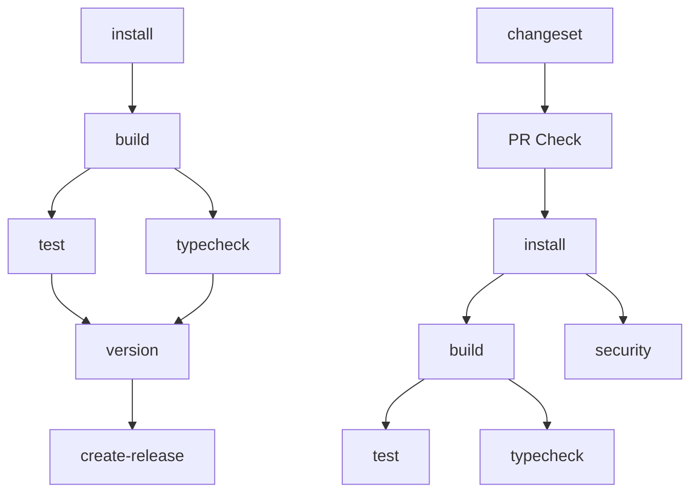

# 工作流依赖关系说明

## 📊 依赖关系图



## 🔄 工作流说明

### 1. CI 工作流 (`.github/workflows/ci.yml`)

**依赖关系**：
- `install` → `build` → `test` / `typecheck`

**执行顺序**：
1. **install**: 安装依赖并缓存
2. **build**: 构建所有包（依赖 install）
3. **test**: 运行测试（依赖 build）- 支持 Node.js 18, 20, 22
4. **typecheck**: 类型检查（依赖 build + 重新构建）

### 2. PR 检查工作流 (`.github/workflows/pr-check.yml`)

**依赖关系**：
- `install` → `build` → `test` / `typecheck`
- `install` → `security`

**执行顺序**：
1. **install**: 安装依赖并缓存
2. **build**: 构建所有包（依赖 install）
3. **test**: 运行测试（依赖 build）
4. **typecheck**: 类型检查（依赖 build + 重新构建）
5. **security**: 安全审计（依赖 install）

### 3. 发布工作流 (`.github/workflows/release.yml`)

**依赖关系**：
- `install` → `build` → `test` / `typecheck` → `version` → `create-release`

**执行顺序**：
1. **install**: 安装依赖并缓存
2. **build**: 构建所有包（依赖 install）
3. **test**: 运行测试（依赖 build）
4. **typecheck**: 类型检查（依赖 build + 重新构建）
5. **version**: 创建版本 PR（依赖 test + typecheck）
6. **create-release**: 创建 GitHub Release（依赖 version）

### 4. Changesets PR 工作流 (`.github/workflows/changeset-pr.yml`)

**依赖关系**：
- 独立执行，无依赖

**执行顺序**：
1. **changeset**: 检查 changesets

## 🎯 关键设计原则

### 1. 依赖缓存
- `install` 任务上传 `node_modules` 作为 artifact
- 后续任务下载依赖，避免重复安装

### 2. 构建产物共享
- `build` 任务上传构建产物
- `test` 和 `typecheck` 任务下载构建产物
- 确保类型检查基于最新的构建结果

### 3. 并行执行
- `test` 和 `typecheck` 可以并行执行
- 都依赖 `build` 完成

### 4. 安全审计
- `security` 任务独立执行
- 只依赖依赖安装，不依赖构建

### 5. 类型检查构建
- `typecheck` 任务在运行类型检查前会重新构建所有包
- 确保所有包的类型声明都是最新的
- 解决 monorepo 中包之间的类型依赖问题

### 6. Node.js 版本支持
- 默认使用 Node.js 22
- 支持 Node.js 18, 20, 22 的矩阵测试
- 使用 pnpm 9.12.3（需要 Node.js 18.12+）

## ⚡ 性能优化

### 1. 缓存策略
```yaml
# 依赖缓存
- name: Upload dependencies
  uses: actions/upload-artifact@v4
  with:
    name: node-modules
    path: node_modules
    retention-days: 1
```

### 2. 构建产物缓存
```yaml
# 构建产物缓存
- name: Upload build artifacts
  uses: actions/upload-artifact@v4
  with:
    name: build-artifacts
    path: |
      packages/*/dist
      packages/*/lib
    retention-days: 7
```

### 3. 依赖关系优化
- 类型检查必须在构建完成后执行
- 测试必须在构建完成后执行
- 发布必须在测试和类型检查都通过后执行
- 类型检查前需要重新构建以确保类型声明最新

## 🔧 故障排除

### 常见问题

1. **类型检查失败**
   - 确保构建成功
   - 检查 TypeScript 配置
   - 验证依赖关系
   - 确保所有包都已构建

2. **测试失败**
   - 确保构建成功
   - 检查测试环境
   - 验证依赖安装

3. **构建失败**
   - 检查依赖安装
   - 验证构建配置
   - 检查包结构

4. **包间依赖错误**
   - 确保依赖包已构建
   - 检查 workspace 配置
   - 验证包引用路径

5. **Node.js 版本错误**
   - 确保使用 Node.js 18.12+ 以支持 pnpm 9.12.3
   - 推荐使用 Node.js 22 以获得最佳性能

### 调试步骤

1. 检查 `install` 任务是否成功
2. 检查 `build` 任务是否成功
3. 检查 `test` 和 `typecheck` 任务
4. 检查 artifact 上传/下载是否成功
5. 检查包构建顺序是否正确
6. 验证 Node.js 版本兼容性
